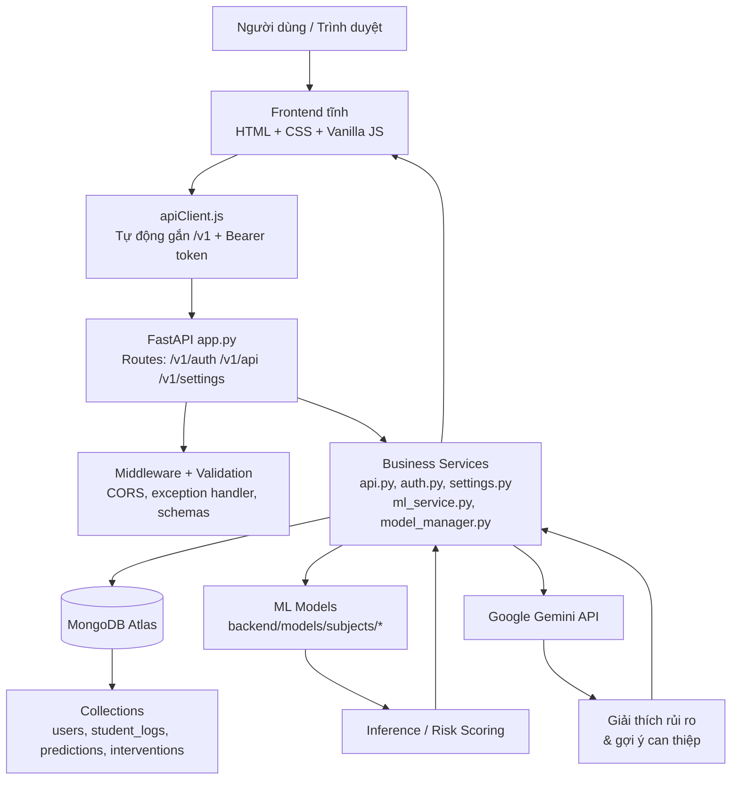

# LMS-Analytics: Learning Management System Analytics

LMS-Analytics là hệ thống phân tích dữ liệu học tập chuyên sâu, được thiết kế để hỗ trợ đội ngũ giảng viên trong việc giám sát tiến trình học tập và nhận diện sớm các sinh viên có nguy cơ học thuật thông qua ứng dụng công nghệ Trí tuệ nhân tạo (ML/AI).

## Các Tính năng Chính
- **Bảng điều khiển Thống kê (Dashboard)**: Cung cấp số liệu tổng quan về hiệu suất học tập của lớp học, bao gồm tỷ lệ sinh viên trong ngưỡng an toàn và các trường hợp cần chú ý.
- **Phân tích Hành vi Chi tiết**: Hệ thống theo dõi và tổng hợp các chỉ số tương tác hàng tuần như tần suất đăng nhập, thời lượng xem video bài giảng, tương tác thảo luận và kết quả bài tập.
- **Dự báo Rủi ro (Early Warning System)**: Tích hợp các mô hình học máy tiên tiến như Logistic Regression, Random Forest và LightGBM để tính toán xác suất rủi ro dựa trên dữ liệu lịch sử.
- **Nhận diện Bất thường**: Sử dụng biểu đồ phân tán (Scatter Plot) để xác định các trường hợp có sự mâu thuẫn giữa nỗ lực tương tác và kết quả điểm số.
- **Tích hợp Trợ lý AI (Gemini AI)**: Hỗ trợ giảng viên giải thích các yếu tố dẫn đến rủi ro học tập và soạn thảo văn bản can thiệp phù hợp cho từng đối tượng sinh viên.

## Công nghệ Sử dụng
- **Backend**: FastAPI (Python), MongoDB Atlas (Database), Scikit-learn, LightGBM.
- **Frontend**: JavaScript (Vanilla), TailwindCSS, Chart.js.
- **AI Integration**: Google Gemini API.

## Sơ đồ kiến trúc hệ thống



### Luồng chính
- Frontend tĩnh gửi request qua `apiClient.js` và tự thêm tiền tố `/v1`.
- FastAPI nhận request, đi qua CORS, validation và error handlers trước khi vào router.
- Backend đọc/ghi MongoDB, chạy suy luận từ model theo subject, và gọi Gemini khi cần giải thích hoặc soạn can thiệp.
- Kết quả trả về dashboard, phân tích sinh viên, cảnh báo sớm và quản lý mô hình.

## Hướng dẫn Vận hành Dự án

Để xem hướng dẫn chi tiết từng bước về cách cài đặt, cấu hình môi trường (.env), nhập dữ liệu và xử lý các lỗi thường gặp, vui lòng tham khảo tài liệu: 
👉 **[HƯỚNG DẪN CÀI ĐẶT VÀ SỬ DỤNG HỆ THỐNG](HUONG_DAN_CAI_DAT_VA_SU_DUNG.md)**

### Chạy nhanh (Quickstart cho Developer)

1. **Cài đặt & Khởi chạy Backend:**
   ```bash
   cd backend
   pip install -r requirements.txt
   python generate_mock_models.py # Khởi tạo model nếu chưa có
   python app.py
   ```
   *API Docs: `http://127.0.0.1:8000/docs`*

2. **Khởi chạy Frontend:**
   ```bash
   # Mở terminal mới
   cd frontend
   python -m http.server 8080
   ```
   *Truy cập: `http://localhost:8080`*

## Lưu ý quan trọng
- **Quản lý Dữ liệu**: Hệ thống hiện đang kết nối trực tiếp với MongoDB Atlas. Vui lòng cẩn trọng khi thực thi các tác vụ tác động đến cấu trúc dữ liệu.
- **Cấu hình AI**: Để kích hoạt các tính năng phân tích bằng AI, cần cung cấp **Gemini API Key** thông qua giao diện cấu hình tại Dashboard.
- **Chuẩn Database**: Xem tài liệu schema và index tại [backend/DATABASE_SCHEMA.md](backend/DATABASE_SCHEMA.md).

## Migration sang schema chuẩn hóa

Các script migration nằm trong `backend/scripts/`:

```bash
cd backend
python -m scripts.migrate_normalized_schema
python -m scripts.import_csv_batch --csv datasets/template.csv --imported-by admin@local --semester S1 --year 2026 --dry-run
python -m scripts.import_csv_batch --csv <path_to_csv> --imported-by admin@local --semester S1 --year 2026
python -m scripts.backfill_enrollment_refs
python -m scripts.bootstrap_production_indexes
```

Runbook chi tiết: [backend/MIGRATION_RUNBOOK.md](backend/MIGRATION_RUNBOOK.md)

---
*Dự án LMS-Analytics - Hệ thống hỗ trợ giảng dạy và quản lý đào tạo.*
